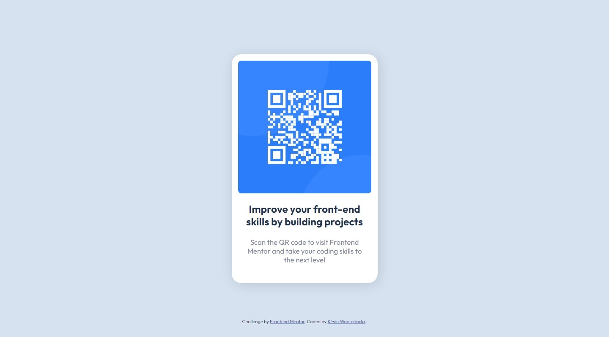

# Frontend Mentor - QR code component solution

This is a solution to the [QR code component challenge on Frontend Mentor](https://www.frontendmentor.io/challenges/qr-code-component-iux_sIO_H). Frontend Mentor challenges help you improve your coding skills by building realistic projects. 

## Table of contents

- [Overview](#overview)
  - [Screenshot](#screenshot)
  - [Links](#links)
- [My process](#my-process)
  - [Built with](#built-with)
  - [What I learned](#what-i-learned)
  - [Continued development](#continued-development)
- [Author](#author)

**Note: Delete this note and update the table of contents based on what sections you keep.**

## Overview

### Screenshots

### Links

- Solution URL: [Solution on GitHub](https://github.com/kwaeterinckx/Challenge_0001-QrCodeComponent)
- Live Site URL: [Live version on Netlify](https://stalwart-custard-853063.netlify.app/)

## My process

### Built with

- Semantic HTML5 markup
- CSS custom properties
- Flexbox
- CSS Grid

### What I learned

Get used to use Flex and Grid layouts, and knowing when to choose one over another depending on the achievment and responsiveness.
I learned to play a bit with the **rem** units.

### Continued development

This is my first coding challenge ever! I'm not new to HTML, CSS and JS. But I'm self-taught, and the time has come to make it my job.
I still need to learn about the newest functionalities (grid e.g.).

## Author

Kévine Waeterinckx

- Frontend Mentor - [@kwaeterinckx](https://www.frontendmentor.io/profile/kwaeterinckx)
- GitHub - [kwaeterinckx](https://github.com/kwaeterinckx)
- LinkedIn - [Kévin Waeterinckx](https://www.linkedin.com/in/kévin-waeterinckx-58256518a)
